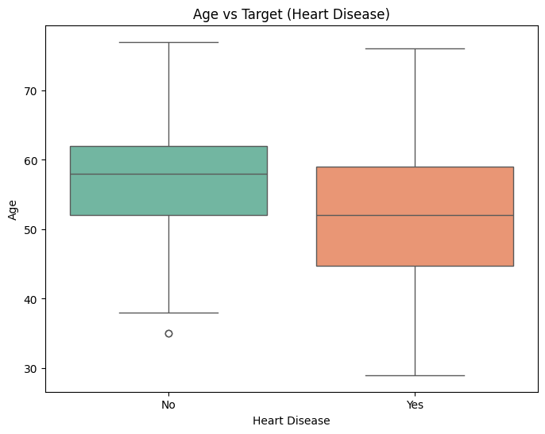

Heart Disease Dataset Analysis

This project is a comprehensive exploratory data analysis (EDA) of the Heart Disease dataset, focusing on univariate, bivariate, and multivariate analysis techniques. The dataset helps in understanding patterns and insights into factors affecting heart disease.

We're exploring the Heart Disease dataset, which contains various attributes related to cardiovascular health, such as age, cholesterol levels, chest pain type, and maximum heart rate.

The analysis uses Python, along with libraries such as Pandas, Matplotlib, and Seaborn for data manipulation and visualization.

📄 Project Files

1 - HeartDiseaseDataset.ipynb — Jupyter notebook with step-by-step analysis
2 - HeartDiseaseDataset.pdf — PDF export of the notebook
3 - README.md — this file, providing a detailed project overview

🧠 Summary of Insights

Univariate Analysis:

1. Distribution of age shows the majority of patients are between 50 and 60 years old.
   Patients with heart disease tend to have a higher median age compared to those without heart disease.

Bivariate Analysis:

2. Strong relationships observed between chest pain type and maximum heart rate.
   Patients with chest pain type 0 have the lowest median maximum heart rate.

3. Multivariate Analysis:

   A heatmap of correlations highlights significant relationships among variables, such as age, thalach (maximum heart rate), and cholesterol.

```python
# Hello, We're going to start working with Heart Disease Dataset, You can find it here:
# https://www.kaggle.com/datasets/johnsmith88/heart-disease-dataset/data


# Here are the arributes of the dataset:

# age
# sex
# chest pain type (4 values)
# resting blood pressure
# serum cholestoral in mg/dl
# fasting blood sugar > 120 mg/dl
# resting electrocardiographic results (values 0,1,2)
# maximum heart rate achieved
# exercise induced angina
# oldpeak = ST depression induced by exercise relative to rest
# the slope of the peak exercise ST segment
# number of major vessels (0-3) colored by flourosopy
# thal: 0 = normal; 1 = fixed defect; 2 = reversable defect
# target: Presence of heart disease (1 = yes, 0 = no).


# What you're to learn in this notebook:
# 1. How to load the dataset
# 2. How to explore the dataset
# 3. How to visualize the dataset

# Particularly, We will be seeing different techniques to analyze the dataset, including:
# Univariate Analysis
# Bivariate Analysis
# Multivariate Analysis


```

```python
# importing libraries
import pandas as pd
import numpy as np
import matplotlib.pyplot as plt
import seaborn as sns
```

```python
# Loading the dataset

df = pd.read_csv('C:\\Users\\nikrc\\OneDrive\\Desktop\\Datasets\\heart.csv')
# TO show all columns in the dataset
pd.set_option('display.max_columns',None)

# Blocking the warnings
import warnings
warnings.filterwarnings('ignore')


df.head(10)
```

<div>
<style scoped>
    .dataframe tbody tr th:only-of-type {
        vertical-align: middle;
    }

    .dataframe tbody tr th {
        vertical-align: top;
    }

    .dataframe thead th {
        text-align: right;
    }

</style>
<table border="1" class="dataframe">
  <thead>
    <tr style="text-align: right;">
      <th></th>
      <th>age</th>
      <th>sex</th>
      <th>cp</th>
      <th>trestbps</th>
      <th>chol</th>
      <th>fbs</th>
      <th>restecg</th>
      <th>thalach</th>
      <th>exang</th>
      <th>oldpeak</th>
      <th>slope</th>
      <th>ca</th>
      <th>thal</th>
      <th>target</th>
    </tr>
  </thead>
  <tbody>
    <tr>
      <th>0</th>
      <td>52</td>
      <td>1</td>
      <td>0</td>
      <td>125</td>
      <td>212</td>
      <td>0</td>
      <td>1</td>
      <td>168</td>
      <td>0</td>
      <td>1.0</td>
      <td>2</td>
      <td>2</td>
      <td>3</td>
      <td>0</td>
    </tr>
    <tr>
      <th>1</th>
      <td>53</td>
      <td>1</td>
      <td>0</td>
      <td>140</td>
      <td>203</td>
      <td>1</td>
      <td>0</td>
      <td>155</td>
      <td>1</td>
      <td>3.1</td>
      <td>0</td>
      <td>0</td>
      <td>3</td>
      <td>0</td>
    </tr>
    <tr>
      <th>2</th>
      <td>70</td>
      <td>1</td>
      <td>0</td>
      <td>145</td>
      <td>174</td>
      <td>0</td>
      <td>1</td>
      <td>125</td>
      <td>1</td>
      <td>2.6</td>
      <td>0</td>
      <td>0</td>
      <td>3</td>
      <td>0</td>
    </tr>
    <tr>
      <th>3</th>
      <td>61</td>
      <td>1</td>
      <td>0</td>
      <td>148</td>
      <td>203</td>
      <td>0</td>
      <td>1</td>
      <td>161</td>
      <td>0</td>
      <td>0.0</td>
      <td>2</td>
      <td>1</td>
      <td>3</td>
      <td>0</td>
    </tr>
    <tr>
      <th>4</th>
      <td>62</td>
      <td>0</td>
      <td>0</td>
      <td>138</td>
      <td>294</td>
      <td>1</td>
      <td>1</td>
      <td>106</td>
      <td>0</td>
      <td>1.9</td>
      <td>1</td>
      <td>3</td>
      <td>2</td>
      <td>0</td>
    </tr>
    <tr>
      <th>5</th>
      <td>58</td>
      <td>0</td>
      <td>0</td>
      <td>100</td>
      <td>248</td>
      <td>0</td>
      <td>0</td>
      <td>122</td>
      <td>0</td>
      <td>1.0</td>
      <td>1</td>
      <td>0</td>
      <td>2</td>
      <td>1</td>
    </tr>
    <tr>
      <th>6</th>
      <td>58</td>
      <td>1</td>
      <td>0</td>
      <td>114</td>
      <td>318</td>
      <td>0</td>
      <td>2</td>
      <td>140</td>
      <td>0</td>
      <td>4.4</td>
      <td>0</td>
      <td>3</td>
      <td>1</td>
      <td>0</td>
    </tr>
    <tr>
      <th>7</th>
      <td>55</td>
      <td>1</td>
      <td>0</td>
      <td>160</td>
      <td>289</td>
      <td>0</td>
      <td>0</td>
      <td>145</td>
      <td>1</td>
      <td>0.8</td>
      <td>1</td>
      <td>1</td>
      <td>3</td>
      <td>0</td>
    </tr>
    <tr>
      <th>8</th>
      <td>46</td>
      <td>1</td>
      <td>0</td>
      <td>120</td>
      <td>249</td>
      <td>0</td>
      <td>0</td>
      <td>144</td>
      <td>0</td>
      <td>0.8</td>
      <td>2</td>
      <td>0</td>
      <td>3</td>
      <td>0</td>
    </tr>
    <tr>
      <th>9</th>
      <td>54</td>
      <td>1</td>
      <td>0</td>
      <td>122</td>
      <td>286</td>
      <td>0</td>
      <td>0</td>
      <td>116</td>
      <td>1</td>
      <td>3.2</td>
      <td>1</td>
      <td>2</td>
      <td>2</td>
      <td>0</td>
    </tr>
  </tbody>
</table>
</div>

```python
# Before we proceed with EDA , It's necessary to understand our dataset better.
```

```python
# Let's understand the shape of the dataset
print(f"The number of rows and columns in the dataset is: {df.shape[0], df.shape[1]}")
```

    The number of rows and columns in the dataset is: (1025, 14)

```python
# Descriptive statistics of the dataset
print("Descriptive statistics of the dataset:")
df.describe().T
```

    Descriptive statistics of the dataset:

<div>
<style scoped>
    .dataframe tbody tr th:only-of-type {
        vertical-align: middle;
    }

    .dataframe tbody tr th {
        vertical-align: top;
    }

    .dataframe thead th {
        text-align: right;
    }

</style>
<table border="1" class="dataframe">
  <thead>
    <tr style="text-align: right;">
      <th></th>
      <th>count</th>
      <th>mean</th>
      <th>std</th>
      <th>min</th>
      <th>25%</th>
      <th>50%</th>
      <th>75%</th>
      <th>max</th>
    </tr>
  </thead>
  <tbody>
    <tr>
      <th>age</th>
      <td>1025.0</td>
      <td>54.434146</td>
      <td>9.072290</td>
      <td>29.0</td>
      <td>48.0</td>
      <td>56.0</td>
      <td>61.0</td>
      <td>77.0</td>
    </tr>
    <tr>
      <th>sex</th>
      <td>1025.0</td>
      <td>0.695610</td>
      <td>0.460373</td>
      <td>0.0</td>
      <td>0.0</td>
      <td>1.0</td>
      <td>1.0</td>
      <td>1.0</td>
    </tr>
    <tr>
      <th>cp</th>
      <td>1025.0</td>
      <td>0.942439</td>
      <td>1.029641</td>
      <td>0.0</td>
      <td>0.0</td>
      <td>1.0</td>
      <td>2.0</td>
      <td>3.0</td>
    </tr>
    <tr>
      <th>trestbps</th>
      <td>1025.0</td>
      <td>131.611707</td>
      <td>17.516718</td>
      <td>94.0</td>
      <td>120.0</td>
      <td>130.0</td>
      <td>140.0</td>
      <td>200.0</td>
    </tr>
    <tr>
      <th>chol</th>
      <td>1025.0</td>
      <td>246.000000</td>
      <td>51.592510</td>
      <td>126.0</td>
      <td>211.0</td>
      <td>240.0</td>
      <td>275.0</td>
      <td>564.0</td>
    </tr>
    <tr>
      <th>fbs</th>
      <td>1025.0</td>
      <td>0.149268</td>
      <td>0.356527</td>
      <td>0.0</td>
      <td>0.0</td>
      <td>0.0</td>
      <td>0.0</td>
      <td>1.0</td>
    </tr>
    <tr>
      <th>restecg</th>
      <td>1025.0</td>
      <td>0.529756</td>
      <td>0.527878</td>
      <td>0.0</td>
      <td>0.0</td>
      <td>1.0</td>
      <td>1.0</td>
      <td>2.0</td>
    </tr>
    <tr>
      <th>thalach</th>
      <td>1025.0</td>
      <td>149.114146</td>
      <td>23.005724</td>
      <td>71.0</td>
      <td>132.0</td>
      <td>152.0</td>
      <td>166.0</td>
      <td>202.0</td>
    </tr>
    <tr>
      <th>exang</th>
      <td>1025.0</td>
      <td>0.336585</td>
      <td>0.472772</td>
      <td>0.0</td>
      <td>0.0</td>
      <td>0.0</td>
      <td>1.0</td>
      <td>1.0</td>
    </tr>
    <tr>
      <th>oldpeak</th>
      <td>1025.0</td>
      <td>1.071512</td>
      <td>1.175053</td>
      <td>0.0</td>
      <td>0.0</td>
      <td>0.8</td>
      <td>1.8</td>
      <td>6.2</td>
    </tr>
    <tr>
      <th>slope</th>
      <td>1025.0</td>
      <td>1.385366</td>
      <td>0.617755</td>
      <td>0.0</td>
      <td>1.0</td>
      <td>1.0</td>
      <td>2.0</td>
      <td>2.0</td>
    </tr>
    <tr>
      <th>ca</th>
      <td>1025.0</td>
      <td>0.754146</td>
      <td>1.030798</td>
      <td>0.0</td>
      <td>0.0</td>
      <td>0.0</td>
      <td>1.0</td>
      <td>4.0</td>
    </tr>
    <tr>
      <th>thal</th>
      <td>1025.0</td>
      <td>2.323902</td>
      <td>0.620660</td>
      <td>0.0</td>
      <td>2.0</td>
      <td>2.0</td>
      <td>3.0</td>
      <td>3.0</td>
    </tr>
    <tr>
      <th>target</th>
      <td>1025.0</td>
      <td>0.513171</td>
      <td>0.500070</td>
      <td>0.0</td>
      <td>0.0</td>
      <td>1.0</td>
      <td>1.0</td>
      <td>1.0</td>
    </tr>
  </tbody>
</table>
</div>

```python
# What do we understand from the above statistics?

# The dataset contains 303 rows and 14 columns.
# The age of the patients ranges from 29 to 77 years.
# The maximum heart rate achieved is between 71 and 202.
# The target variable 'target' indicates whether a patient has heart disease (1) or not (0).
```

```python
# What are the datatypes of the columns?

print("Datatypes of the columns:")
print(df.dtypes)
```

    Datatypes of the columns:
    age           int64
    sex           int64
    cp            int64
    trestbps      int64
    chol          int64
    fbs           int64
    restecg       int64
    thalach       int64
    exang         int64
    oldpeak     float64
    slope         int64
    ca            int64
    thal          int64
    target        int64
    dtype: object

```python
# Checking if there are any missing values in the dataset
df.isnull().sum()
```

    age         0
    sex         0
    cp          0
    trestbps    0
    chol        0
    fbs         0
    restecg     0
    thalach     0
    exang       0
    oldpeak     0
    slope       0
    ca          0
    thal        0
    target      0
    dtype: int64

```python
# There are no missing values in the dataset

# Now, We can also check for duplicates in the dataset
duplicates = df.duplicated().sum()
print(f"Number of duplicate rows in the dataset: {duplicates}")
```

    Number of duplicate rows in the dataset: 723

```python
# Removing Duplicates
df.drop_duplicates(inplace=True)
```

```python
# Here we are going to learn about different types of analysis techniques that can be used to analyze the dataset.

# 1. Univariate Analysis:
# Analysis of a single variable to understand its distribution and basic properties.
# 2. Bivariate Analysis:
# Bivariate analysis involves analyzing the relationship between two variables in the dataset.
# 3. Multivariate Analysis:
# Multivariate analysis involves analyzing the relationship between three or more variables in the dataset.

```

```python
# Before starting, Let's Divide the dataset into two parts:
# Numerical and Categorical features

# Numerical features
numerical_features = df.select_dtypes(include=['int64', 'float64']).columns.tolist()
# Categorical features
categorical_features = df.select_dtypes(include=['object', 'category']).columns.tolist()

# Why is it important to separate numerical and categorical features?
# Because different analysis techniques are applied to numerical and categorical data.

# Different data types require different visualization techniques.

# This table would help you:

# | Data Type   | Visualization Technique |
# |-------------|-------------------------|
# | Numerical   | Histogram, Boxplot      |
# | Categorical | Bar Chart, Pie Chart    |
# | Time Series | Line Chart              |
# | Text        | Word Cloud, Bar Chart   |


# Let's now print the numerical and categorical features
print("Numerical Features:")
print(numerical_features)
print("\nCategorical Features:")
print(categorical_features)

```

    Numerical Features:
    ['age', 'sex', 'cp', 'trestbps', 'chol', 'fbs', 'restecg', 'thalach', 'exang', 'oldpeak', 'slope', 'ca', 'thal', 'target']

    Categorical Features:
    []

```python
# As you can see, all the features in the dataset are numerical, but age,sex and target are categorical features.
# So, we will treat them as categorical features for the purpose of analysis.

# But it will be better to convert 'sex' column to categorical type and add another target column with 'Yes' and 'No'
# We're naming that Heart Disease
df['Heart Disease'] = df['target'].apply(lambda x: "Yes" if x == 1 else "No")

df['sex'] = df['sex'].astype('category')
df['sex'] = df['sex'].apply(lambda x: "M" if x == 1 else "F")

```

```python
# Univariate Analysis

# Distribution Analysis for age (KDE or Histograms)

plt.figure(figsize=(8, 6))
sns.histplot(df['age'],kde = True, color='blue')
plt.title('Age Distribution')
plt.xlabel('Age')
plt.ylabel('Frequency')
plt.show()


```


```python
# What can we observe from the above plot?
# The plot shows that the age distribution is slightly right-skewed, with most patients being in their 50s and 60s.
# Mostly concentrated between 40 and 60 years of age.
```

```python
# Summary Statistics for age
age_summary = df['age'].describe()
print("Summary Statistics for Age: \n",age_summary)

mean_age = df['age'].mean()
median_age = df['age'].median()
std_deviation = df['age'].std()

print()

print(f"Mean Age: {mean_age}")
print(f"Median Age: {median_age}")
print(f"Standard Deviation of Age: {std_deviation}")

```

    Summary Statistics for Age:
     count    302.00000
    mean      54.42053
    std        9.04797
    min       29.00000
    25%       48.00000
    50%       55.50000
    75%       61.00000
    max       77.00000
    Name: age, dtype: float64

    Mean Age: 54.420529801324506
    Median Age: 55.5
    Standard Deviation of Age: 9.047969746247457

```python
# What can get from the above statistics?

# This indicates that the ages of the patients are generally around 54 years, with some variation.
# And the mean and median are close to each other, indicating a relatively symmetric distribution.
```

```python
# Outliers in age
plt.figure(figsize=(8, 6))
sns.boxplot(x = df['age'],color = 'orange')
plt.title('Boxplot of Age')
plt.xlabel('Age')
plt.show()
```


```python
# There are no outliers in the age column, as the boxplot shows no points outside the whiskers.
# You can also use the IQR method to detect outliers in the age column, but in this case, there's no need as the boxplot already shows no outliers.
```

```python
# Univariate Analysis for thalach
plt.figure(figsize=(8, 6))
sns.histplot(df['thalach'], kde=True, color='green')
plt.title('Maximum Heart Rate Achieved Distribution')
plt.xlabel('Maximum Heart Rate Achieved (thalach)')
plt.ylabel('Frequency')
plt.show()


```


```python
# What can we observe from the above plot?
# The plot shows that the maximum heart rate achieved is generally between 120 and 180, with a peak around 150.
```

```python
# Outliears in thalach

# Earlier we used boxplot , Let's use IQR method for this one
Q1 = df['thalach'].quantile(0.25)
Q2 = df['thalach'].quantile(0.75)
IQR = Q2 - Q1

lower_bound = Q1 - 1.5 * IQR
upper_bound = Q2 + 1.5 * IQR

outliers = df[(df['thalach'] < lower_bound) | (df['thalach'] > upper_bound)]
print(f"Number of outliers in thalach: {len(outliers)}")
```

    Number of outliers in thalach: 1

```python
# Here, We don't need to remove the outliers as they are not significant enough to affect the analysis.
```

```python
# Univariate Analysis for target
plt.figure(figsize=(8, 6))
df['Heart Disease'].value_counts().plot.pie(autopct='%1.1f%%', colors=['lightblue', 'lightcoral'], startangle=90)
plt.title('Distribution of Target(Heart Disease)')
plt.ylabel('')
plt.show()
```


```python
# What to observe from the above plot?
# We can see that there are more patients without heart disease (No) than with heart disease (Yes).
# We can say that the dataset is imbalanced
```

```python
# Let's Now Begin with Bivariate Analysis


# Bivariate Analysis
# Bivariate analysis involves analyzing the relationship between two variables in the dataset.

# Let's start with the relationship between age and target (heart disease)
plt.figure(figsize=(8, 6))
sns.boxplot(x='Heart Disease', y='age', data=df, palette='Set2')
plt.title('Age vs Target (Heart Disease)')
plt.xlabel('Heart Disease')
plt.ylabel('Age')
plt.show()
```



```python
# We can se that the Individuals without heart disease tend to have a slightly higher median age compared to those with heart disease.
# also, the age distribution for individuals with heart disease is more spread out, indicating a wider range of ages.

```

```python
# Correlation Analysis

correlation = df['age'].corr(df['thalach'])
print(f"Correlation between Age and Maximum Heart Rate Achieved (thalach): {correlation:.2f}")


# First we need to extract numerical values for correlation analysis
numerical_features = df.select_dtypes(include=['int64', 'float64'])

# Correlation HeatMap
plt.figure(figsize=(8, 6))
sns.heatmap(numerical_features.corr(), annot=True, cmap='rocket', linewidths=0.5)
plt.title('Correlation Heatmap')
plt.show()
```

    Correlation between Age and Maximum Heart Rate Achieved (thalach): -0.40


```python
# We can see that the highest correlation is between 'cp' (chest pain type) and 'target' (heart disease),
# followed by 'thalach' (maximum heart rate achieved) and 'target'.
```

```python
# Average Cholestrol by Sex

plt.figure(figsize=(8, 6))
sns.barplot(x = 'sex', y = 'chol',data=df, palette='mako')
plt.title('Average Cholestrol by Sex')
plt.xlabel("Gender")
plt.ylabel('Average Cholestrol')
plt.show()
```


```python
# Here we can see that the average cholesterol level is slightly higher for Females compared Males.

# Further we can create a cross-tabulation
pd.crosstab(df['sex'], df['target'], margins=True)

```

<div>
<style scoped>
    .dataframe tbody tr th:only-of-type {
        vertical-align: middle;
    }

    .dataframe tbody tr th {
        vertical-align: top;
    }

    .dataframe thead th {
        text-align: right;
    }

</style>
<table border="1" class="dataframe">
  <thead>
    <tr style="text-align: right;">
      <th>target</th>
      <th>0</th>
      <th>1</th>
      <th>All</th>
    </tr>
    <tr>
      <th>sex</th>
      <th></th>
      <th></th>
      <th></th>
    </tr>
  </thead>
  <tbody>
    <tr>
      <th>F</th>
      <td>24</td>
      <td>72</td>
      <td>96</td>
    </tr>
    <tr>
      <th>M</th>
      <td>114</td>
      <td>92</td>
      <td>206</td>
    </tr>
    <tr>
      <th>All</th>
      <td>138</td>
      <td>164</td>
      <td>302</td>
    </tr>
  </tbody>
</table>
</div>

```python
# Distribution for age and cp
plt.figure(figsize=(8, 6))
sns.boxplot(x='cp', y='age', data=df, palette='mako')
plt.title('Age vs Chest Pain Type')
plt.xlabel('Chest Pain Type')
plt.ylabel('Age')
plt.show()
```


```python
# We can see that chest pain type 3 has the highest median age, while chest pain type 1 has the lowest median age.
# This indicates that individuals with chest pain type 3 tend to be older compared to those with other chest pain types.
```

```python
# Relationship between thalach and cp (chest pain type)
plt.figure(figsize=(8, 6))
sns.boxplot(x='cp', y='thalach', data=df, palette='mako')
plt.title('Maximum Heart Rate Achieved (thalach) vs Chest Pain Type')
plt.xlabel('Chest Pain Type')
plt.ylabel('Maximum Heart Rate Achieved (thalach)')
plt.show()
```


```python
# We can clearly see that chest pain type 0 has the lowest median maximum heart rate achieved (thalach), while chest pain type 1 has the highest median maximum heart rate achieved (thalach).
# This indicates that individuals with chest pain type 0 tend to have lower maximum heart rates compared to those with other chest pain types.
```

```python
# Moving onto the Multivariate Analysis

# Multivariate Analysis

# Multivariate analysis involves analyzing the relationship between three or more variables in the dataset.

# Let's start with the relationship between age, thalach (maximum heart rate achieved), and target (heart disease)
plt.figure(figsize=(8, 6))
sns.scatterplot(x='age', y='thalach', hue='Heart Disease', data = df, palette='colorblind', alpha=0.7)
plt.title('Age vs Maximum Heart Rate Achieved (thalach) by Heart Disease')
plt.xlabel('Age')
plt.ylabel('Maximum Heart Rate Achieved (thalach)')
plt.legend(title='Heart Disease')
plt.show()
```


```python
# What can we observe from the above pie chart?
# The scatter plot shows that as age increases, the maximum heart rate achieved (thalach) tends to decrease.

```

```python
#  Now,let's analyze the relationship between chest pain type (cp), maximum heart rate achieved (thalach), and target (heart disease)
plt.figure(figsize=(8, 6))
sns.pairplot(df, vars=['cp', 'thalach'], hue='target', palette='mako')
plt.suptitle('Pairplot of Chest Pain Type, Maximum Heart Rate Achieved, and Cholesterol by Heart Disease', y=1.02)
plt.show()

```

    <Figure size 800x600 with 0 Axes>


```python
# We can see that individuals with chest pain type 0 tend to have lower maximum heart rates achieved (thalach) compared to those with other chest pain types.
# This indicates that chest pain type 0 is associated with lower maximum heart rates, while chest pain types 1, 2, and 3 are associated with higher maximum heart rates.
```

```python
# This marks the end of our analysis on the Heart Disease Dataset.
# We have performed univariate, bivariate, and multivariate analysis to understand the relationships between different variables in the dataset.
# We have also visualized the data using various plots to gain insights into the dataset.
# The analysis shows that age, chest pain type, and maximum heart rate achieved are important factors in determining the presence of heart disease.
# Thank you for reading this notebook, I hope you found it helpful.

# If you have any questions or suggestions, feel free to reach out.
# Happy Learning!
```
